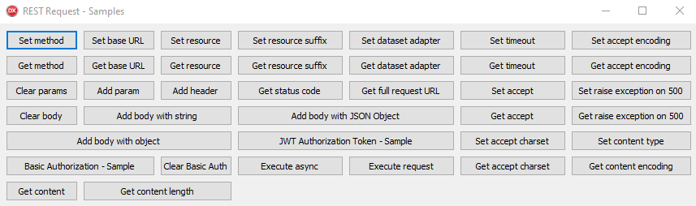

# REST Request for Delphi


 
RESTRequest4Delphi is a REST request facilitator made for applications built in Delphi. With it, we eliminate the TRESTClient components: TRESTResponse, TRESTResponseDataSetAdapter, THTTPBasicAuthenticator and TRESTRequest. For ease of use, RESTRequest4Delphi uses the Fluent Interface / Fluent API (how to name methods to be used with the impression that you are writing a text).
 
## Prerequisites
 * `[Optional]` For ease I recommend using the Boss for installation
   * [**Boss**](https://github.com/HashLoad/boss) - Dependency Manager for Delphi
 
## Installation using Boss (dependency manager for Delphi applications)
```
boss install github.com/viniciussanchez/RESTRequest4Delphi
```

## Manual Installation
Add the following folders to your project, in *Project > Options > Resource Compiler > Directories and Conditionals > Include file search path*
```
../RESTRequest4Delphi/src/core
../RESTRequest4Delphi/src/interfaces
```

## Getting Started
You need to use RESTRequest4D.Request.Intf and RESTRequest4D.Request
```pascal
uses RESTRequest4D.Request.Intf, RESTRequest4D.Request;
```

#### Method

Use `Request.GetMethod` method to get the method set. `rmGET` is default parameter.

```pascal
begin
  Request.SetMethod(rmGET); // Use REST.Types
end;
``` 

#### URL

You can set the URL in several ways. Use the one that suits you.

```pascal
begin
  Request.SetBaseURL('http://localhost:8080/datasnap/rest/servermethods/method');
  Request.SetBaseURL('http://localhost:8080/datasnap/rest').SetResource('servermethods/method');
  Request.SetBaseURL('http://localhost:8080/datasnap/rest').SetResource('servermethods').SetResourceSuffix('method');
end;
``` 

To get the values set use:

```pascal
begin
  Request.GetBaseURL;
  Request.GetResource;
  Request.GetResourceSuffix;
  Request.GetFullRequestURL(True);
end;
```

In the `GetFullRequestURL` method the parameter indicates whether to add the parameters. Default is `True`.

#### Body

You can assign the request body with different types of parameters (strings, JSON and objects). To clear the body of a request, simply use `Request.Body.Clear`. The second parameter indicates who is responsible for destroying the object. Default is `True`. See the samples:

```pascal
begin
  Request.Body.Add('Any thing');  
  Request.Body.Add(TJSONObject.Create, True);  
  Request.Body.Add(TObject.Create, True);
end;
```

#### DataSet Adapter

You can add a dataset to adapter. The contents of the request will be loaded into the dataset. We recommend using TFDMemTable.

```pascal
begin
  Request.SetDataSetAdapter(FDMemTable);
end;
```

You can get the dataset as follows:

```pascal
var
  MemTable: TFDMemTable;
begin
  MemTable := Request.GetDataSetAdapter as TFDMemTable;
end;
```

#### Parameters

You can add parameters and headers. To clear the parameters, use the `Request.Params.Clear`. When you add a parameter with the same name, its value changes. See the samples:

```pascal
begin
  Request.Params.AddParam('country', 'Brazil');
  Request.Params.AddHeader('Accept-Encoding', 'gzip');
end;
```

#### Basic Authentication

You can add a basic authentication to the request. To remove the authentication use `Request.Authentication.Clear`.

```pascal
begin
  Request.Authentication.SetUsername('user').SetPassword('password');
end;
```

#### JWT - JSON Web Tokens

Here's an example of how to add the token generated by JWT in your request. To generate the JWT token, see the [**delphi-jose-jwt**](https://github.com/paolo-rossi/delphi-jose-jwt) repository

```pascal
begin
  Request.Params.AddHeader('Authorization', 'JWT Token', [poDoNotEncode]);
end;
```

#### Execute

The Execute method will return the Status code. See more in [**HTTP Status Codes**](https://httpstatuses.com/)

```pascal
begin
  Request.Execute;
end;
```

## Samples


